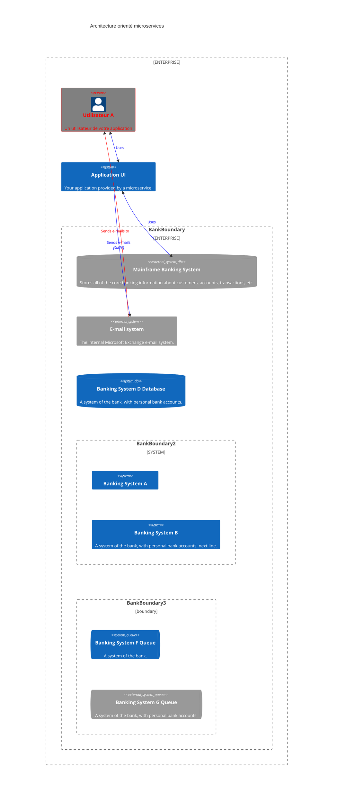

Resolvez facilement vos problèmes d'architecture   

Simplifiez la complexité du déploiement au sein de vos clusters lors de la phase de développement, du déploiement et de l'exploitation des applications.

# Goal

Archway est née du constat que les api-gateway et reverse-proxy presents sur le marché étaient difficiles à mettre en oeuvre.

Plus particulierement la gestion du routage se fait géneralement par configuration de fichiers souvent assez fastidieux qui impose le redémarrage du service.

Certains imposent l'ajout de plugin pour la moindre feature. 

La configuration d'un simple système d'authentification devient rapidement compliquée surtout durant la phase de développement où la géneration des certificats et gestion des DNS ne sont pas des points considérés par les développeurs.

De plus ces mécanismes d'authentification ne couvrent pas la partie des autorisations simplement. L'ajout de fournisseur de service comme keycloak complexifie encore la mise en oeuvre.

Aussi nous avions besoin d'une solution simple pour construire une application basé sur une architecture microservices.

Archway se deploie naturellement dans un cluster docker.     
Il permet de router vers des microservices à l'interieur ou à l'exterieur du cluster (ce qui est pratique lors de la phase de développement). 

Archway est construit sur Spring cloud gateway. 

Il fournit une interface ergonomique sur celui ci en ajoutant les fonctions indispensables pour construire une application basée sur une architecture microservice.

# Technologies

Archway utilise les technologies suivantes:

 - Java 17
 - spring boot 3
 - spring cloud gateway
 - mongodb 6
 - angular 16+ / material
 - fontawesome

# Features

Archway fournit la plupart des mécanismes proposés par spring cloud gateway.

## Spring cloud gateway

Spring cloud gateway introduit 2 concepts principaux

 - Les prédicats: Permettent de définir la régle de routage pour un chemin (service) donnée.
 - Les filters: Permettent de modifier les requêtes ou les rêponses 

Avec Archway vous pourrez:

 - Créer des routes
 - Supprimer des routes
 - Modifier des routes
 - Activer des routes
 - désactiver des routes

Ceci dynamiquement, sans redémarrage.

## Authentication/Autorisation

Archway gére les utilisateurs de l'application. Il permet d'associer des profils aux utilisateurs, qui eux même contiennent des rôles.

Archway gére donc les profils et les rôles de votre application.

Archway introduit aussi une notion de groupes. Different des profils, permettant de faire un groupements des utilsateurs indépendament de leurs fonctions.   
Par eemple cela pourrait être un groupement par région géographique permettant de restreindre l'accés aux données en fonction de la zone géograohique.

Archway permet:

- La gestion des utilisateurs
- La gestion des profils
- La gestion des groupes
- La gestion des droits basée sur RBAC

L'identifiant et les rôles de l'utilisateur sont transmit aux services cible de la gateway. Permettant de sécuriser les endpoints exposés par les microservices.

- HTTP Header: username
- HTTP Header: roles
- HTTP Header: groups

De plus Archway rajoute à spring cloud gateway un mecanisme simple de rôles pour sécuriser une route entière. 

## Preferences utilisateurs

Archway gére aussi certaines préférences utilisateurs, comme la langue par defaut. cette derniere est ajouté aux headers HTTP 'Accept-language' vous permettant de fournir des applications localisées.

Archway nécessite juste d'une base de donnée mongodb pour stocker sa configuration, la gestion des utilisateurs

